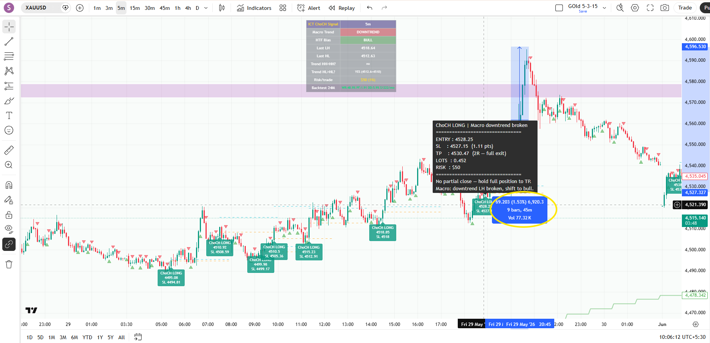
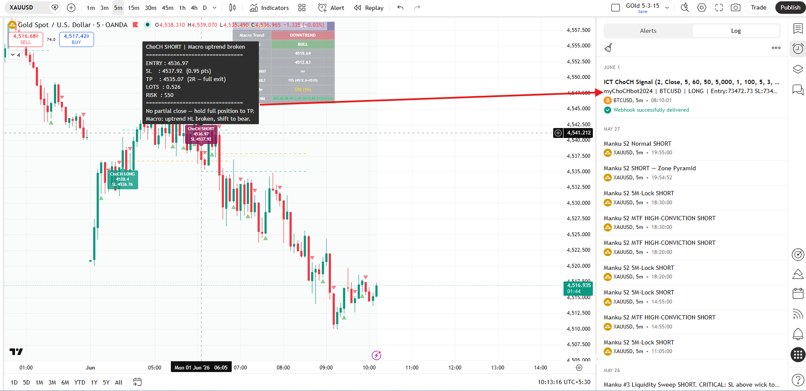
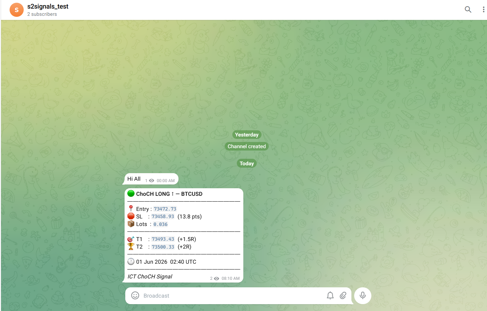

# Pine Script Indicators — ICT & SMC Trading Systems

Custom TradingView indicators built on ICT (Inner Circle Trader) methodology. Developed, backtested, and live-tested on real market data (XAU/USD, NIFTY 50).

> **Source code is private.** Available on request for serious traders.  
> **Contact:** vanrajkalsariya1992@gmail.com

---

## Indicators

### 1. S2 Zone Pyramid v3 — XAU/USD
Supply/demand zone indicator with pyramid entry logic and HTF confluence filter.

- HTF dead zone filter: skips zones within 10 pts of 60M EMA50
- HTF slope visual (EMA BRIGHT = trend aligned, DIM = counter)
- Auto position sizing (risk % based)
- Pyramid entries within zone at fixed step intervals
- Webhook alert → signal bot integration

**Backtest — 2 months live data (Mar–May 2026, XAU/USD)**

| Version | Trades | Win Rate | T2 Rate | SL Rate | Avg/Trade |
|---------|--------|----------|---------|---------|-----------|
| v2 Normal | 33 | 60.6% | 39.4% | 39.4% | +$34 |
| v3 (dist ≥ 10 pts) | 19 | **73.7%** | 42.1% | 26.3% | +$53 |

> Distance filter eliminated low-probability setups. T2 rate = 0% below 10 pts threshold — key insight from data.


---

### 2. S2 Zone Pyramid — NIFTY Edition
Same core logic, re-calibrated for NSE NIFTY 50.

- Session filter: NSE 09:15–15:30 IST only
- HTF dist threshold: 35 pts (≈1.35× ATR, calibrated from 6-month backtest)
- Zone step: 100 pts, range: ±50 pts
- Point value: Rs.50/lot

**Backtest — 6 months, NSE NIFTY**

| Filter | Signals | Win Rate |
|--------|---------|----------|
| No filter | 11 | 64% |
| dist ≥ 35 pts | 8 | **80%** |


---

### 3. ICT ChoCH Signal
Change of Character (ChoCH) detector based on ICT market structure concepts.

- Tracks HH/HL/LH/LL swing structure
- Detects BOS → ChoCH structural flip
- Auto SL above/below the ChoCH swing
- Auto lot sizing based on SL distance
- Webhook alert with entry, SL, lot size



---

## Signal Bot Integration

Both S2 and ChoCH indicators connect to a live Telegram signal bot via TradingView webhooks.

```
TV Alert (bar close) → EC2 Webhook → FastAPI Parser → Telegram Channel
```

Subscribers receive real-time alerts with entry, SL, targets, and lots pre-calculated.




**Signal bot repo:** [trading-signal-bot](https://github.com/vickysw/trading-signal-bot)

---

## Repository Contents

```
├── backtests/
│   ├── s2_zone_pyramid/    # 8 Python backtest scripts
│   ├── ict_choch/          # 8 Python backtest scripts
│   ├── risk_management/    # Position sizing tools
│   └── top5_indicator/     # Top5 combined backtest
├── history_data/
│   ├── tvHistoryData/      # Raw OHLC — XAU/USD (24m), NIFTY
│   └── [trade logs CSVs]   # Backtest output files
└── screenshots/            # Chart + backtest screenshots
```

Full indicator specs → [INDICATORS.md](INDICATORS.md)

---

## Tech Stack

| Layer | Tools |
|-------|-------|
| Indicators | Pine Script v6 |
| Platform | TradingView |
| Backtesting | Python (pandas, numpy) |
| Methodology | ICT — Supply/Demand, ChoCH, BOS, EMA HTF |
| Signal bot | FastAPI, AWS EC2, Telegram Bot API |
| Markets | XAU/USD, NSE NIFTY 50 |

---

## Freelance Services

- Custom Pine Script indicator development (ICT / SMC / custom strategy)
- Python backtest scripts against real market data
- TradingView → Telegram signal bot setup
- Indicator debugging and optimization
- Strategy parameter optimization

**Contact:** vanrajkalsariya1992@gmail.com
